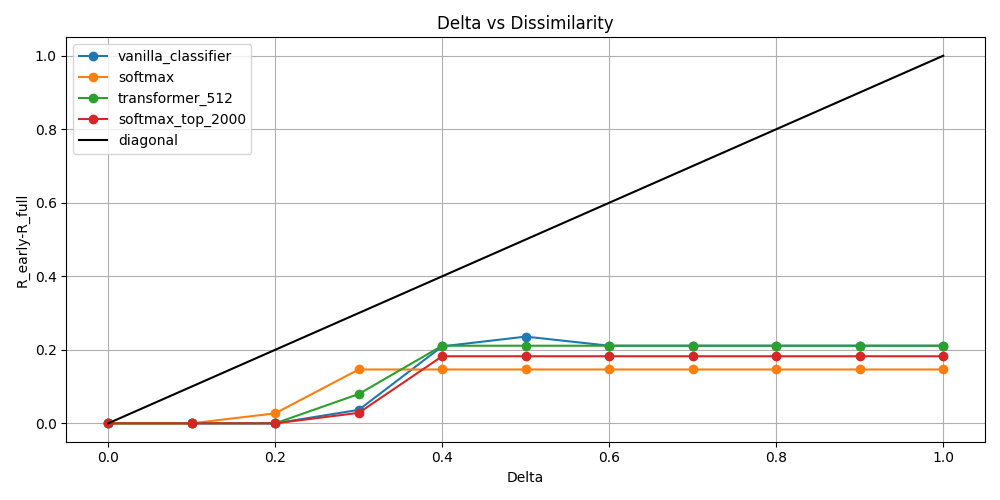
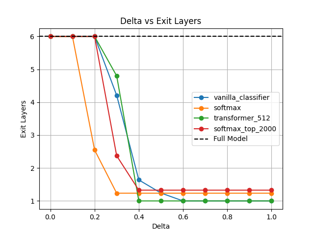

# Introduction to Confident Adaptive Language Modeling (CALM)

Transformer-based autoregressive language models have been shown to achieve remarkable performance on open-ended language generation tasks [1]. However, the large scale of these models limits their applicability in real-world scenarios [2]. Early-exit approaches attempt to address this constraint by allowing the model to skip computations at later layers whenever the confidence of the current prediction is sufficient [3]. Although methods like BERxiT have previously been introduced for encoder-based models [2], Confident Adaptive Language Modeling (CALM) is the first work focusing on autoregressive LLMs [4]. Without significant loss in performance, this framework has been demonstrated to allow for up to three times as fast inference time. Additional improvements can be obtained using simple linear mapping to cast intermediate representations as final-layer representations.

The core idea of the *Confident Adaptive Language Modeling* framework is early-exit in the auto-regressive generation task, meaning that the next token $y_{t+1}$ can be chosen without traversing all $N$ layers of the decoder. This can be achieved by outputting the model's prediction $\text{argmax } p(y_{t+1} | d_t^i)$ at the first layer $i < N$  where its confidence is high enough (Figure 1). This requires estimating the confidence of prediction $c_t^i$ at a given layer $i$ and comparing it with a predefined confidence threshold $\lambda$. If $c_t^i > \lambda$, the model's prediction $\text{argmax } p(y_{t+1} | d_t^i)$ at the current layer can be used to generate the next token. Otherwise, the model must compute the next representation $d_t^{i+1}$.


Figure 1. The Confident Adaptive Language Modeling framework. Figure from [4].

The confidence estimation is a crucial element of CALM; an underperforming method may either underestimate confidence &mdash; causing the model to never exit early and therefore leading to no computational benefit over the base model &mdash; or overestimate the uncertain prediction, causing the quality of the generated text to deteriorate. The authors of the original work propose three robust confidence estimators:  

- **Softmax response** &ndash; confidence is estimated as the difference between top two values of $\text{Softmax}(\mathbf{W}_Nd_t^i)$ with $\mathbf{W}_N$ denoting the weight matrix of the final MLP. This corresponds to the comparison between the probabilities of two most likely tokens being generated after the given layer. The main disadvantage of this method is the need to multiply the hidden-state by $V \times D$ matrix, where $V$ corresponds to the vocabulary size (usually over 30000).
- **Hidden-state saturation**  &ndash; this method estimates confidence based on the cosine similarity between the hidden-state representations after two consecutive layers $d_t^{i-1}$ and  $d_t^{i}$ for $i > 1$. Since computation of similarity between two vectors is relatively inexpensive, the main advantage of this method is its efficiency and ease of implementation.
- **Early-exit classifier** &ndash; a separate linear classifier $\mathcal{M}$ is trained to predict confidence based on the hidden-state at the layer $i$ as $c_t^{i} = \mathcal{M}(d_t^i)$. To avoid impacting the performance of the base model, its weights are frozen during the training of early-exit classifier. While requiring separate training, this method is very efficient during inference as only a multiplication with a $D \times 1$ matrix is required.

In the experiments shown in CALM paper, **softmax response** consistently outperformed the other methods in terms of performance for the same average number of decoder layers traversed per generated token and usually leading to the greatest speedup compared to the baseline.

## **Statistical Guarantees on Early-Exiting Performance**

Besides proposing a new early-exiting mechanism via the confidence measures on intermediate decoder tokens as described above, the paper also presents a statistical procedure which allows the implementer to obtain probabilistic guarantees on the disparity between the generations of the full LLM and the early exiting LLM.

To make this more precise, let $S_{cal} = (P_i)_{i \in [n]}$ be an i.i.d calibration set of prompts. This could be articles to be summarized, or sentences to be translated. Given a prompt $P=(p_1,\dots,p_m)$, the processed encoder states $(e_1,\dots,e_m)$, and a partially generated decoded response $(y_1, \dots, y_t)$ for $t$ less than $m$. To obtain $y_{t+1}$, the decoder computes a decoder state $d_t^i$ for each layer $i$ of $L$, where our decoder block has $L$ layers. This is done in the typical way combining a self-attention block, a cross-attention block and a feed-forward block. Once this is done, a probability distribution over the vocabulary is obtained via soft-maxing the projected final decoder state: $p(y_{t+1}|d_t^L)=softmax(W_L d_t^L)$. 

The key idea of early-exiting is to use some earlier decoder state $d_t^i$ with $i < L$ to obtain this vocabulary distribution. We use some earlier decoder state $d_t^i$ if its local exiting threshold $\lambda_t^i$ is exceeded by the local confidence score $c_t^i$. Several ways of obtaining this local confidence score have been discussed above.

We now turn to the problem of determining $\lambda$. There are two disparities we account for between early-exited and full generations: textual consistency and risk consistency. They are defined as follows.

Let $P'$ be an i.i.d prompt, and let $Y_{early}=LLM_{early}(P'),\ Y_{full} = LLM_{full}(P')$. We say $Y_{early}$ is *textually consistent* with $Y_{full}$ if, given a bounded dissimilarity function $\mathcal{D}$, we have that the dissimilarity is no more than a user-specified tolerance $\delta$ in expectation with high probability:

$$
\mathbb{P}(\mathbb{E}\{\mathcal{D}(Y_{early},Y_{full})\}\leq \delta) \geq 1- \varepsilon
$$

for $\varepsilon \in (0,1)$. To define *risk consistency*, we require a dataset which also comes with labels/targets. Here $S_{cal}=(P_i,Z_i)_{i \in [n]}$. Given a bounded risk function $\mathcal{R}$, we have risk consistency if 

$$
\mathbb{P}(\mathbb{E}[\mathcal{R}(Y_{early},Z_{test})-\mathcal{R}(Y_{full},Z_{test})]\leq \delta)\geq 1- \varepsilon
$$

where $\delta, \varepsilon$ are tolerance, confidence parameters respectively. 

Going forward, we change the notation for LLMs slightly. Since $LLM_{early}$ depends on $\lambda$ - the exiting threshold - we’ll highlight this by writing $LLM_{early}(\lambda, \cdot ).$ Note $LLM_{full}(1,\cdot).$ The recipe for determining the confidence threshold is as follows:

1. We supply a list of possible threshold values $\Lambda = (\lambda_1, \dots, \lambda_k).$ 
2. Select the minimal value of $\lambda$ that is valid w.r.t risk or textual consistency. 

To do so, we use the Learn Then Test (LTT) framework of Angelopolous et al.

In short, this creates for each $\lambda_j \in \Lambda$ a null hypothesis 

$$
H_j: LLM_{early}(\lambda_j,P_{test})\ \text{and}\ LLM_{full}(P_{test})\ \text{are not consistent.}
$$

This hypothesis is rejected/accepted dependent on a p-value $p_j$, which is derived (via e.g. Hoeffding’s inequality) from the empirical consistency of $LLM_{early}(\lambda_j, P_i)$  with the prompts $P_i$ taken from $S_{cal}$, the tolerance $\delta$ and the number of samples. 

The method also takes advantage of two pieces of observed regularity in how the choice of $\lambda$ affects early-exiting:

1. Nearby thresholds $\lambda \approx \lambda’$ perform similarly, 
2.  If $\lambda_1>\lambda_2$, then the textual/risk consistency of $LLM_{early}(\lambda_1, \cdot)$ is less than that of $LLM_{early}(\lambda_2,\cdot)$.

Given this, we order $\Lambda$ in descending order, where $\lambda_1=1$. For each $\lambda_i$ in order, if $H_i$ is rejected we go on to $\lambda_{i+1}$. If $H_i$ is accepted, then $\lambda_{i-1}$ is returned as the calibration threshold guaranteeing our consistency constrains with high probability. This algorithm is seen in Appendix E of the CALM paper. We have also provided an implementation of this in our code base, see calibration_process.py.


## Related work

Improving the efficiency of LLMs is being studied in several different ways. Model quantization approaches reduce model size by decreasing the precision of the weights, and also speed up inference by reducing the precision to which the activations are calculated [5].  Another method is pruning, in which unimportant parts of the model may be removed [6]. Knowledge distillation uses outputs from the large 'teacher' model (the original trained model) to train a smaller 'student' model to produce similar outputs with fewer parameters [7]. 

The approach studied in the CALM paper is *early exiting*, where the model can decide to stop processing a token without having passed the token through every layer of the transformer. Early exiting was first proposed for transformers used for classification by Schwartz et al. (2020) [3]. Then, Xin et al. (2021) introduced BERxiT to deal with more general tasks than just classification [2]. Recently, it has been shown that the top-ranked prediction for a token often does not change after a certain layer [8], motivating both the CALM paper and our choice for an extension in which we decide to only propagate the top-ranked tokens to subsequent layers.


# Review

Further gains in the efficiency of autoregressive LLMs would increase the accessibility of these models for applications in both academia and industry. Although the CALM framework already provides a noticeable improvement in the inference time, the best performing confidence estimation method &mdash; **softmax response** &mdash; introduces significant computational overhead by requiring multiplication of the tokens with a weight matrix of the final layer MLP. This leads to $\mathcal{O}(VD)$ time complexity, where the $V$ denotes the output vocabulary size and $D$ is the dimensionality of hidden representation. In extreme cases, the inference may take more time compared to the original model for difficult tokens where the required confidence threshold is exceeded only in the later layers.


Figure 2. Inference time comparison for full T5-small model and CALM framework

The above plot shows that even when using a high confidence threshold of $\lambda = 0.9$, CALM with **softmax response** confidence estimation can lead to a noticeable improvement in the inference times without much decrease to $\text{ROUGE-L}_{sum}$ scores. However, it can be observed that over 20% of the inference time is spent on confidence estimation &mdash; if the model's predictions were more uncertain and the average number of layers after which the prediction is returned would be higher, it would happen that the prediction time for CALM model would exceed that of the baseline model. Additional attention should then be given to reducing the time needed for confidence estimation when a higher number of layers is need to be traversed before obtaining confident predictions.

Additionally, the impact of analysing the full history of representations generated at previous layers rather than only the current layer has not been analysed by the authors of CALM. Out of the three confidence estimation methods, two of them (**softmax response** and **early-exit classifier**) utilise only the latest hidden representation, while **hidden-state saturation** takes the outputs of two most recent layers into consideration. However, it remains to be seen whether utilisation of the full history of generation hidden-states may prove beneficial to the performance of early-exit methods, especially for models consisting of many layers.


Figure 3. High-level illustration of softmax reponse/early-exit classifiers

Lastly, the original method employs a complex calibration procedure for finding an exit threshold $\lambda \in [0, 1]$ such that the early-exit predictions remain consistent with respect to the full model. Furthermore, the provided statistical guarantees are unlikely to generalise. The assumption under which the model operates is that the calibration set $S_{cal}$ is representative of the entire distribution of prompts. This is a strong assumption, and in certain situations, it is unlikely to hold. While this may work for cases where the LLM operates on a constrained dataset (for example, an LLM used only to summarise news articles), it will likely not work for LLMs that are used in e.g. chatbots, where users can input any prompt they want, some of which will be out-of-distribution. The statistical guarantees provided by the CALM paper may therefore provide a false sense of confidence in the outputs. Thus, we aim to compare the speed/accuracy tradeoff of a naively selected threshold (i.e. hyperparameter search) with a calibrated threshold, to determine whether the calibration provides a noticeable benefit.

# Contribution

## Top-k token propagation

The first of our contributions &mdash; **top-k token propagation** &mdash; addresses the problem of the computational overhead within **softmax response** confidence estimation method. Following the findings of [8], it can be expected that even after the first layer a model should be capable of narrowing down the range of probable tokens significantly from the full cardinality of vocabulary set. Therefore, we start by selecting the $K$ tokens with the highest probability values at the output of the first decoder layer, and then only considering these tokens downstream. More precisely, top $K$ most probable tokens after the first layer and computing only the logits corresponding to these tokens in the following layers. With $K << V$, we believe that this change should lead to a noticeable decrease in the time spent on confidence estimation. 

To better illustrate the introduced modifications, we provide the comparison between the high-level pseudo-code of both the original CALM method (**softmax response**) and our **top-k token propagation**:
```
input:
  hidden_states - input token embeddings
  threshold - confidence threshold for early-exit
  K - number of propagated tokens                                         # used in our extension


top_k_indices = None                                                      # used in our extension

for decoder_layer in decoder:
  hidden_states = pass hidden_states through the decoder_layer


  === CALM ===
  logits = process hidden_states using final MLP of the decoder           # O(D x V), highly parallelizable
  probs = computer softmax of logits                                      # O(V)
  top1, top2 = find 2 highest probabilities in probs                      # O(V + 2 log V), based on PyTorch implementation
  confidence = top1 - top2                                                # O(1)
  === CALM ===


  === Ours ===
  if top_k_indices is None:                                               # only for the first decoder layer
    logits = process hidden_states using final MLP of the decoder         # O(D x V), highly parallelizable
    probs = computer softmax of logits                                    # O(V)
    probs, top_k_indices = find K highest probabilities (sorted) and corresponding indices in probs
                                                                          # O(V + K log V), based on PyTorch implementation
    top1, top2 = chose the top 2 elements from the sorted list            # O(1)
    confidence = top1 - top2                                              # O(1)

    W_topk = index K rows from MLP weight matrix using top_k_indices      # O(K)

  else:                                                                  
    logits = W_topk @ hiddden_states                                      # O(D x K), highly parallelizable
    probs = computer softmax of logits                                    # O(K)
    top1, top2 = find 2 highest probabilities in probs                    # O(K + 2 log K), based on PyTorch implementation
    confidence = top1 - top2                                              # O(1)
  === Ours ===


  if confidence > threshold:
    output the next token based on probs                                  # use top_k_indices to align K-dimensional logits with the expected output size
```
Pseudocode 1. Comparison between the logic of original softmax response and our variant supplemented with top-k token propagation.

Although matrix-vector multiplication involving a full weight matrix of the final MLP has a time complexity $O(D \times V)$, it should be remembered that this operation can be efficiently parallelised on GPUs; thus, the actual contribution of this operation to the confidence estimation process is likely smaller than it could be expected looking at the time complexity. Beyond a certain point, further decrease in the matrix size may not even lead to efficiency improvements as the multiplication will not be utilising all of the compute units of the GPU. However, other operations within **softmax response** method, such as softmax calculation and finding 2 highest probabilities, also depend on the vocabulary size and will benefit from smaller number of logits to consider.

The presented pseudo-code shows one potential problem with our extension &mdash; while we successfully managed to reduce the time complexity for all operations involved in confidence estimation starting from the second layer, it is now necessary to find the probabilities and indices corresponding to $K$ most probable tokens in layer one. Additionally, the rows corresponding to these tokens must be extracted from the weight matrix of the final MLP, requiring additional time. As a consequence, we expect our method to increase the time needed for confidence estimation at the first layer, but decrease it significantly for the layers downstream. The improvement coming from this method depends then both on the number of propagated tokens K as well as the expected number of layers that will be traversed before the models is confident enough to output a token &mdash; if the number of traversed layers is small enough, the additional time needed for calculating the confidence at the first layer may outweight the benefits of decreasing it at further layers.

## Attention-based classifier 

In our work, we also introduce a method of considering the entire history of hidden states while estimating the confidence by utilising a small **attention-based classifier** following every layer of the full auto-regressive model. This consists of a simple, one layer, attention only transformer (followed by a linear layer or MLP) whose inputs are *all* of the hidden states at a given layer l. No method for calculating confidence scores used in the original paper makes use of all hidden states at a particular layer, instead only relying on the hidden state at the final position. It seems plausible that making use of the hidden states at every previous position will provide additional useful information about the model's level of confidence, because future layers' hidden states at the final position will be affected by earlier positions' hidden states at the current layer. For this reason, we expect it to provide a more robust confidence estimation compared to other methods.

Moreover, the **attention-based classifier** should usually have a lower inference cost when compared to the most robust method in the original paper, the **softmax response**. This is because the time complexity for the **attention-based classifier** will be $\mathcal{O}(D N^2)$, where $N$ is the sequence length and $D$ is the model dimension. The **softmax response**, on the other hand, has a time complexity of $\mathcal{O}(V D)$, where $V$ is the vocabulary size. Therefore we have that for sufficiently small $N$, the **attention-based classifier** will be faster during inference than the **softmax response**, while also potentially providing more robust confidence estimation.


Figure 4. High-level illustration of the proposed transformer confidence classifier

## Reproduction of the threshold calibration process

In addition, we perform experiments to investigate the improvement in performance due to the calibration method used in the paper over a naive baseline. No such comparison with a naive baseline is done in the original paper, which seems like a significant oversight. The calibration method used in the original paper is fairly complicated and involves non-trivial statistical methods (e.g. multiple hypothesis testing). It also adds a small amount of computational overhead during inference. The authors justify their confidence threshold selection method by saying that having a statistical guarantee of performance is often useful. Our experiments here investigate when the calibration method used in the paper is empirically superior to naive confidence threshold selection without use of hypothesis testing. This will allows us to judge the necessity of calibration step when using different confidence estimation methods.

# Experiments

## Setup

We perform all of our experiments using a T5-small model [9] and the CNN/DM summarization dataset [10]. T5-small is an encoder-decoder model which has been trained on a range of tasks, including summarization, and performs well on them [11]. The CNN/DM dataset consists of approximately 300,000 news articles and corresponding summaries. We chose to use this model and dataset as they were used in the original paper, and we wanted as close a comparison as possible.

Our codebase was built off an implementation used in the Fast Robust Early Exiting paper [12], which implements the basic structure of early exiting.

We made use of the ROUGE-L score [13] as our primary performance metric. This is a standard metric for evaluating summarization performance.

We began by finetuning the model on the summarization dataset for 3 epochs. Finetuning brought our model from a ROUGE-LSUM of **26.73** to **29.67**.

For the evaluation of **top-k token propagation** methods, we modified the `DeployT5Stack.forward()` method in accordance with the changes proposed in Pseudocode 1. We evaluate the performance of this method using the model finetuned for CNN/DM dataset. Since no additional training was required for **top-k token propagation**, all experiments for it could run on a consumer-grade GPU RTX 3070ti, allowing us to run more time-consuming jobs on the compute cluster.

## Calibration
For the calibration, we ran the calibration as described in the paper on the following confidence measures:
- Classifier
- Softmax
- Transformer (512 dim)
- Top-k propagation (our extension measure with K=2000)

For each of these, we perform a full search across a range of delta values from 0.1 to 1 in steps of 0.1.
We also used candidate confidence thresholds of 1 to 0.05 in steps of 0.05.

## Top-k propagation

## Classifier training

We implemented four types of confidence classifier. These were as follows

- Linear
- MLP
- Transformer (64 dim)
- Transformer (512 dim)

The linear classifier is identical to the "early-exit classifier" used in the original paper [4]. It consists of a simple linear layer of shape $(d_{model}, 2)$, sending hidden states to confidence logits.

The MLP classifier instead consists of a simple one layer feed-forward neural network with hidden dimension $d_{model}$ and a ReLU non-linearity [14].

The transformer classifiers consisted of a single attention layer followed by a one layer feed-forward neural network with hidden dimension $d_{model}$ and a ReLU non-linearity. We trained one transformer with a projection from $d_{model} = 512$ down to $64$ in the attention layer and one without this projection. We did this to investigate the time/performance tradeoff of a reduction in the dimension of the attention layer.

Each of these classifiers were trained with an "oracle loss". This "oracle loss" is a binary cross-entropy loss with respect to the output of the confidence method, with the target at each layer $l$ being $\delta(\text{argmax}(W_{final}h_{l}) = \text{argmax}(W_{final}h_{final}))$. In other words, the loss aims to train the classifier to output $1$ when the token outputted at the current layer agrees with the final token, and to output $0$ otherwise.

We trained each of these for approx. 0.25 epochs each (due to compute constraints) with the SGD optimizer at a learning rate of $10^{-4}$.

# Results

## Top-k propagation 
First, we compare the performance of the **top-k token propagation** with the original **softmax response** method for different numbers of propagated tokens and confidence thresholds. For both $\lambda = 0.5$ and $\lambda = 0.9$, using only 2000 most probable tokens to compute confidence allowed for an increase in the number of generated tokens per second at a slight cost to the $\text{ROUGE-L}_\text{sum}$ metric. Overall, it is possible to observe the trends we have expected in the **Contribution** section &mdash; the benefits of using our method become more noticeable as greater number of layers needs needs to be traversed to get sufficiently confident prediction


Table 1. Prediction performance and inference time for full T5-small, CALM and our top-k token propagation extension.

Delving deeper into the distribution of time spent on confidence estimation between different layers, we can find proof of why our method performs better for larger average number of decoder layers. As expected, we observe an additional time overhead for the first layer that seems to scale linearly with the value of parameter $K$, while for deeper layers it is possible to obtain up to 40% speedup for confidence computation step for $K$ equal to 2000. The speed benefits get smaller as the number of propagated tokens increased; however, this allows for maintaining metrics closer to the full CALM framework &mdash; for $K=10000$ there is almost no difference in $\text{ROUGE-L}_\text{sum}$ compared to basic CALM with a slight efficiency improvement for $\lambda = 0.9$.


Figure 5. Average time spent on confidence estimation per layer given different number of propagated tokens.


## Comparison of all confidence methods by speed/performance

In order to compare the confidence methods used, we perform evaluation for each method for a wide range of confidence thresholds. We report comparisons in two ways:

  - how ROUGE varies with the average number of decoder blocks used (figure 4)
  - how ROUGE varies with the average evaluation runtime normalised by generation length (figure 5).
  
In the latter plot, we normalise by generation length as this varies substantially across different setups and confounds the eval runtime. Note that softmax (2000) and softmax (10000) refer to the softmax reponse confidence method with top 2000 token propagation and top 10000 token propagation respectively.


Figure 4. ROUGE vs. average number of decoder blocks used by confidence method

Figure 4 shows a noticeable difference in performance between the softmax response methods and the classifiers (i.e. linear/MLP/transformers). The softmax response performs substantially better than static exiting (in other words, always exiting at a given layer without use of any confidence metric) as well as all of the confidence classifiers. All softmax response varieties perform similarly well here.

We see our classifiers exhibit approximately the expected pattern in performance (namely that the linear classifier performs worst while the two transformer classifiers perform best). Surprisingly, we find that all of these classifiers compare unfavourably with static exiting. We suspect that this is because our classifiers are substantially undertrained due to compute constraints. We had to train each classifier on only about 25% of the available data (in other words, we trained for approximately 0.25 epochs). In the original paper, the classifiers perform only marginally better than static exiting, so it seems plausible that undertraining is sufficient to explain the lackluster performance of our classifiers. Nevertheless, we find that our proposed transformer extension performs better than the linear classifier described in the original paper.


Figure 5. Rouge vs. evaluation runtime [Note: Softmax (full) is not in this plot due to time/compute constraints. It will be in the final version.]

In order to more directly compare the time-performance tradeoff between different confidence methods, we plot ROUGE against average eval runtime in Figure 5. Note that these times are quite noisy due to differing cluster loads and generation lengths. However, some patterns are evident.

First of all, static exiting performs best for any given runtime. We believe this is because there is a substantial amount of overhead involved in early exiting, and due to the fact that we use a small model, this overhead dominates the inference speed improvement of early exiting. No wall clock times are reported in the original paper, so we are unable to verify whether the original authors identified a similar phenomenon. 

Beyond static exiting, we see that softmax response has the fastest runtimes for high ROUGE values, and that the (non-linear) classifiers perform the best for middling ROUGE values (<25).

Note also that the odd appearance of the curves near the bottom of the ROUGE range is because low confidence thresholds tend to lead to bad ROUGE scores and very long generations - therefore the decrease in inference time per token is drowned out by the increase in generation length. It is unclear why low confidence thresholds tend to lead to long generations, but this pattern was also observed by the authors of FREE [12].

## Calibration 
The purpose of this section is primarily reproductive, although we also display our contributions where possible. Specifically, for the CNN-DM dataset, we perform the experiments of Appendix B1, albeit with the smaller T5 model as discussed above. As explained in the section summarising the statistical methods of CALM, there are two dissimilarity measures. Throughout all these plots, $\epsilon = 0.05.$ We start with risk:
### Risk consistency
 Figure 1 shows the RogueL values plotted against delta values for different early exit measure approaches for risk consistency, both the confidence measures of the paper (softmax and vanilla_classifer), as well as our own contributions. We see an initial increase in RogueL values for the measures softmax and the classifier from 0.2 to 0.4, after which we observe a steady value for RougeL around 0.2. When compared with Figure B2(a) of the paper, we observe identical trends; early growth before stabilisation around a risk dissimilarity of .2. In the paper figure, the risk asymptote is slightly lower at .1, this could be explained by the larger model and more extensive fine-tuning used there.
 
<p align="center">
  
  <br>
  <em>Figure 1: Plot of the risk consistency of various models for varying tolerance values δ.</em>
</p>

Figure 2 shows how the average layer of exit evolves as we increase the tolerance. The softmax performs well here, as we see noticeble speed-up for $\delta \geq .1$ In comparison with Figure B2(a) of the paper, the decrease in exit layer occurs at a slightly higher tolerance value however the overall trends are reproduced.

<p align="center">
  
  <br>
  <em>Figure 2: Plot of the average exit layer of various models for varying tolerance values δ, using risk consistency during calibration.</em>
</p>

### Textual consistency

Figure 3 shows Textual consistency plotted against delta values; for the shown measure, we observe a similar trend to that of the authors. We observe softmax is the best performing confidence measure given a tolerance. For our proposed confidence measure of using an attention based method, and for the authors' classifier, we notice there are datapoints larger than the diagonal. We recall that the statistical method used to determine the confidence threshold doesn't exclude this possiblity, but makes it a low probability event.

<p align="center">
  
  <br>
  <em>Figure 3: Plot of the dissimilarity of various models for varying tolerance values δ</em>
</p>

Figure 4 shows the delta values plotted against the average exit layer for different measures. In the authors' figure B1(a), both the softmax and classifier measures average exit layer immediately descend for non-zero tolerance levels. We observe a difference here, in that for all measures, the tolerance must be larger than .2 before we begin to observe a decrease in the mean exit layer. This may again reflect the difference in fine-tuning, which could manifest in earlier, faster converging decoder states. 

<p align="center">
  
  <br>
  <em>Figure 4: Plot of the average layer of exit across various confidence measures for varying tolerance values δ, using textual dissimilarity.</em>
</p>

### Sample size effects

We also investiaged briefly the effects of different samples sizes on the calibration proccess.

Figure 5 shows the effect of performing calibration using different sample sizes to assess the calibration method's sensitivity to changes in sample size.
The plot above shows that the dissimilarity metrics stabilize between 0.15 and 0.25. 
<p align="center">
  
  <br>
  <em>Figure 5: Effects of sample size on calibration with respect to the dissimilarity metric (risk) </em>
</p>


Shown in Figure 6, we see the effect of a change in sample size on the exit layer in relation to delta. 
We see that with larger samples, the model exists with lower values of delta, which is what we would expect.

<p align="center">
  
  <br>
  <em>Figure 6: Effects of sample size on calibration with respect to the exit layer (risk) </em>
</p>


# Conclusion
To conclude, for a smaller model than that used in the CALM paper, we reproduced and verified the claims of their calibration process, namely, that their proposed confidence measures can drastically reduce inference time with a tunable risk. We reproduced the finding that the softmax measure was most effective, and observed very similar trends for both textual and risk consistency evolution against tolerance across confident measures.

We further added our own confidence measures and compared their performance. Our methods did not beat those of the authors' in terms of early exiting for fixed tolerance, or in regards to moderating the dissimilarity of the early generated sequence. Given the smaller model we had access to as well as our limited fine-tuning, it is unclear the cause of our seemingly theoretically justified extensions. We also made several expansions to an existing Pytorch repository such as adding a stastical calibration infrastructure which may provide useful to future researchers. 


# Contributions per student

Luan Fletcher - Implemented confidence classifiers (linear, transformer, MLP) and did associated data analysis and writeup

Konrad Szewczyk - Implemented top-k propagation and did associated data analysis and writeup

Daniel Goodwin - Implementation and investigation/reproduction of calibration process

Andrew Heath - Implementation and investigation/reproduction of calibration process

Robert van der Klis - Reproduction of original paper results and finetuning of models

# References
[1] T. Brown et al., “Language Models are Few-Shot Learners,” in Advances in Neural Information Processing Systems, Curran Associates, Inc., 2020, pp. 1877–1901. Accessed: May 27, 2024. [Online]. Available: https://papers.nips.cc/paper/2020/hash/1457c0d6bfcb4967418bfb8ac142f64a-Abstract.html

[2] J. Xin, R. Tang, Y. Yu, and J. Lin, “BERxiT: Early Exiting for BERT with Better Fine-Tuning and Extension to Regression,” in Proceedings of the 16th Conference of the European Chapter of the Association for Computational Linguistics: Main Volume, P. Merlo, J. Tiedemann, and R. Tsarfaty, Eds., Online: Association for Computational Linguistics, Apr. 2021, pp. 91–104. doi: 10.18653/v1/2021.eacl-main.8.

[3] R. Schwartz, G. Stanovsky, S. Swayamdipta, J. Dodge, and N. A. Smith, “The Right Tool for the Job: Matching Model and Instance Complexities,” in Proceedings of the 58th Annual Meeting of the Association for Computational Linguistics, D. Jurafsky, J. Chai, N. Schluter, and J. Tetreault, Eds., Online: Association for Computational Linguistics, Jul. 2020, pp. 6640–6651. doi: 10.18653/v1/2020.acl-main.593.

[4] T. Schuster et al., “Confident Adaptive Language Modeling,” in Advances in Neural Information Processing Systems, S. Koyejo, S. Mohamed, A. Agarwal, D. Belgrave, K. Cho, and A. Oh, Eds., Curran Associates, Inc., 2022, pp. 17456–17472. [Online]. Available: https://proceedings.neurips.cc/paper_files/paper/2022/file/6fac9e316a4ae75ea244ddcef1982c71-Paper-Conference.pdf

[5] D. D. Lin, S. S. Talathi, and V. S. Annapureddy, “Fixed Point Quantization of Deep Convolutional Networks.” arXiv, Jun. 02, 2016. doi: 10.48550/arXiv.1511.06393.

[6] S. Han, J. Pool, J. Tran, and W. J. Dally, “Learning both Weights and Connections for Efficient Neural Networks.” arXiv, Oct. 30, 2015. doi: 10.48550/arXiv.1506.02626.

[7] G. Hinton, O. Vinyals, and J. Dean, “Distilling the Knowledge in a Neural Network.” arXiv, Mar. 09, 2015. doi: 10.48550/arXiv.1503.02531.

[8] M. Geva, A. Caciularu, K. Wang, and Y. Goldberg, “Transformer Feed-Forward Layers Build Predictions by Promoting Concepts in the Vocabulary Space,” in Proceedings of the 2022 Conference on Empirical Methods in Natural Language Processing, Y. Goldberg, Z. Kozareva, and Y. Zhang, Eds., Abu Dhabi, United Arab Emirates: Association for Computational Linguistics, Dec. 2022, pp. 30–45. doi: 10.18653/v1/2022.emnlp-main.3.

[9] Adam Roberts, Hyung Won Chung, Anselm Levskaya, Gaurav Mishra, James Bradbury, Daniel
Andor, Sharan Narang, Brian Lester, Colin Gaffney, Afroz Mohiuddin, Curtis Hawthorne, Aitor
Lewkowycz, Alex Salcianu, Marc van Zee, Jacob Austin, Sebastian Goodman, Livio Baldini
Soares, Haitang Hu, Sasha Tsvyashchenko, Aakanksha Chowdhery, Jasmijn Bastings, Jannis
Bulian, Xavier Garcia, Jianmo Ni, Andrew Chen, Kathleen Kenealy, Jonathan H. Clark, Stephan
Lee, Dan Garrette, James Lee-Thorp, Colin Raffel, Noam Shazeer, Marvin Ritter, Maarten
Bosma, Alexandre Passos, Jeremy Maitin-Shepard, Noah Fiedel, Mark Omernick, Brennan
Saeta, Ryan Sepassi, Alexander Spiridonov, Joshua Newlan, and Andrea Gesmundo. Scaling
up models and data with t5x and seqio. arXiv preprint arXiv:2203.17189, 2022. URL
https://arxiv.org/abs/2203.17189.

[10] Karl Moritz Hermann, Tomas Kocisky, Edward Grefenstette, Lasse Espeholt, Will
Kay, Mustafa Suleyman, and Phil Blunsom. Teaching machines to read and comprehend. In C. Cortes, N. Lawrence, D. Lee, M. Sugiyama, and R. Garnett, editors, Advances in Neural Information Processing Systems, volume 28. Curran Associates, Inc., 2015. URL https://proceedings.neurips.cc/paper/2015/file/
afdec7005cc9f14302cd0474fd0f3c96-Paper.pdf.

[11] Colin Raffel, Noam Shazeer, Adam Roberts, Katherine Lee, Sharan Narang, Michael Matena,
Yanqi Zhou, Wei Li, and Peter J. Liu. Exploring the limits of transfer learning with a unified
text-to-text transformer. 2019.

[12] Bae, Sangmin, et al. "Fast and robust early-exiting framework for autoregressive language models with synchronized parallel decoding." arXiv preprint arXiv:2310.05424 (2023).

[13] Chin-Yew Lin. Rouge: A package for automatic evaluation of summaries. In Text summarization
branches out, pages 74–81, 2004.

[14] Agarap, Abien Fred. "Deep learning using rectified linear units (relu)." arXiv preprint arXiv:1803.08375 (2018).


