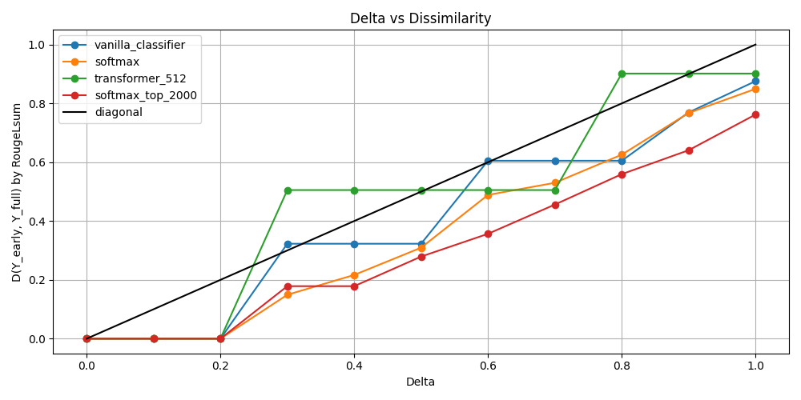
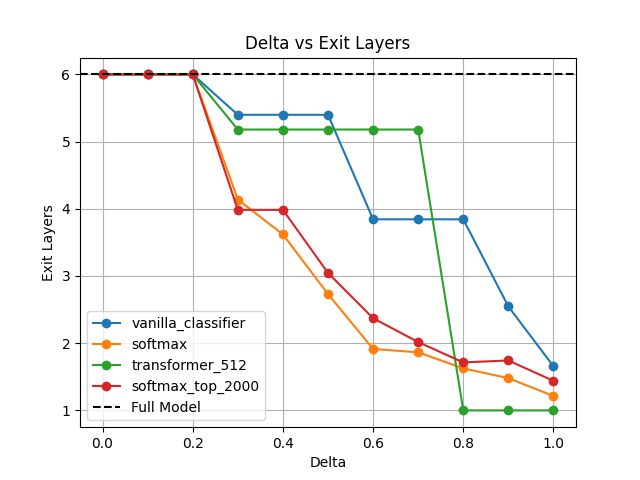

# Introduction
```An analysis of the paper and its key components. Think about it as a nicely formatted review as you would see on OpenReview.net. It should contain one paragraph of related work as well.```

Transformer-based autoregressive language models have been shown to achieve remarkable performance on open-ended language generation tasks. However, the large scale of these models limits their applicability in real-world scenarios. Early-exit approaches attempt to address this constraint by allowing the model to skip computations at later layers whenever the confidence of the current prediction is sufficient. Although methods like BERxiT have existed for encoder-based models, Confident Adaptive Language Modeling (CALM) is the first work focusing on autoregressive LLMs. Without significant loss in performance, this framework has been demonstrated to allow for up to x3 speedup in inference time. Additional improvements can be obtained using simple linear mapping to cast intermediate representations as final-layer representations.

## Related work

Improving the efficiency of LLMs is being studied in several different ways. Model quantization approaches reduce model size by decreasing the precision of the weights, and also speed up inference by reducing the precision to which the activations are calculated (https://arxiv.org/abs/1511.06393).  Another method is pruning, in which unimportant parts of the model may be removed (https://arxiv.org/pdf/1506.02626). Knowledge distillation uses outputs from the large 'teacher' model (the original trained model) to train a smaller 'student' model to produce similar outputs with fewer parameters (https://arxiv.org/abs/1503.02531). 

The approach studied in the CALM paper is *early exiting*, where the model can decide to stop processing a token without having passed the token through every layer of the transformer. Early exiting was first proposed for transformers used for classification by Schwartz et al. (2020) (https://arxiv.org/pdf/2004.07453). Then, Xin et al. (2021) (https://aclanthology.org/2021.eacl-main.8.pdf) introduced BERxiT to deal with more general tasks than just classification. Recently, it has been shown that the top-ranked prediction for a token often does not change after a certain layer (https://arxiv.org/abs/2203.14680), motivating both the CALM paper and our choice for an extension in which we decide to only propagate the top-ranked tokens to subsequent layers.

## Confident Adaptive Language Modelling (CALM)
The core idea of *Confident Adaptive Language Modelling" framework is early-exit in the auto-regressive generation task, meaning that the next token $y_{t+1}$ can be chosen without traversing all $N$ layers of the decoder. This can be achieved by outputting the model's prediction $\text{argmax } p(y_{t+1} | d_t^i)$ at the first layer $i < N$  where its confidence is high enough. This requires estimating the confidence of prediction $c_t^i$ at a given layer $i$ and comparing it with a predefined confidence threshold $\lambda$. If $c_t^i > \lambda$, the model's prediction $\text{argmax } p(y_{t+1} | d_t^i)$ at the current layer can be used to generate the next token. Otherwise, the model must compute the next representation $d_t^{i+1}$.


The confidence estimation is a crucial element of CALM; an underperforming method may either underestimate confidence --- leading to no computational benefit over the base model --- or overestimate the uncertain prediction, causing the quality of the generated test to deteriorate. The authors of the original work propose three robust confidence estimators:  

- **Softmax response** --- confidence is estimated as the difference between top two values of $\text{Softmax}(\mathbf{W}_Nd_t^i)$ with $\mathbf{W}_N$ denoting the weight matrix of the final MLP. This corresponds to the comparison between the probabilities of two most likely tokens being generated after the given layer. The main disadvantage of this method is the need to multiply the hidden-state by $V \times D$ matrix, where $V$ corresponds to the vocabulary size (usually over 30000).
- **Hidden-state saturation**  --- this method estimates confidence based on the cosine similarity between the hidden-state representations after two consecutive layers $d_t^{i-1}$ and  $d_t^{i}$ for $i > 1$. Since computation of similarity between two vectors is relatively inexpensive, the main advantage of this method is its efficiency and ease of implementation.
- **Early-exit classifier** --- a separate linear classifier $\mathcal{M}$ is trained to predict confidence based on the hidden-state at the layer $i$ as $c_t^{i} = \mathcal{M}(d_t^i)$. To avoid impacting the performance of the base model, its weights are frozen during the training of early-exit classifier. While requiring separate training, this method is very efficient during inference as only a multiplication with a $D \times 1$ matrix is required.

In the experiments shown in CALM paper, **softmax response** consistently outperformed the other methods in terms of performance for the same average number of decoder layers traversed per generated token and usually leading to the greatest speedup compared to the baseline.

# Experiments
Mention here that all experiments only used the CNN/Daily Mail dataset and the T5-small model.

## Calibration
For the calibration we ran the calibiration as descripted in the paper on the following confidence measures:
- Classifier
- Softmax
- Transformer (512 dim)
- Top-k propagation (our extension measure)

For each of these we perform a full search across a range of delta values from 0.1 to 1 in steps of 0.1.
We also provide candidate confidence thresholds of 1 to 0.05 in steps of 0.05.

# Review

`Exposition of its weaknesses/strengths/potential which triggered your group to come up with a response`

Further gains in the efficiency of autoregressive LLMs would increase the accessibility of these models for applications in both academia and industry. Although the CALM framework already provides a noticeable improvement in the inference time, the best performing confidence estimation method --- **softmax response** --- introduces significant computational overhead by requiring multiplication of the tokens with a weight matrix of the final layer MLP. This leads to $\mathcal{O}(VD)$ time complexity, where the $V$ denotes the output vocabulary size and $D$ is the dimensionality of hidden representation. In extreme cases, the inference may take more time compared to the original model for difficult tokens where the required confidence threshold is exceeded only in the later layers.

Additionally, the impact of analysing the full history of representations generated at previous layers rather than only the current layer has not been analysed by the authors of CALM. Out of the three confidence estimation methods, two of them (**softmax response** and **early-exit classifier**) utilise only the latest hidden representation, while **hidden-state saturation** takes the outputs of two most recent layers into consideration. However, it remains to be seen whether utilisation of the full history of generation hidden-states may prove beneficial to the performance of early-exit methods, especially for models consisting of many layers.


Lastly, the original method employs a complex calibration procedure for finding an exit threshold $\lambda \in [0, 1]$ such that the early-exit predictions remain consistent with respect to the full model. However, the authors have not shown the experiments comparing the statistically-calibrated threshold with naive choice of $\lambda$. Hence, it may be possible to consider a simplified version of the early-exit framework with the calibration process omitted.

# Contribution

`Describe your novel contribution.`

Our works consists of three main contributions to the CALM framework, each focusing on one of the weaknesses described in the previous section.

The first of our contributions --- **top-k token propagation** --- addresses the problem of the computational overhead within **softmax response** confidence estimation method by selecting $\text{top-}K$ most probable tokens after the first layer and computing only the logits corresponding to these tokens in the following layers. With $K << V$, we believe that this change should lead to a noticeable decrease in the time spent on confidence estimation. 

**ADD A SNIPPET OF CODE COMPARED WITH THE NORMAL WORKFLOW**

In our work, we also introduce a method of considering the entire history of hidden states while estimating the confidence by utilising a small **attention-based classifier** following every layer of the full auto-regressive model. This consists of a simple, one layer, attention only transformer whose inputs are *all* of the hidden states at a given layer l. No method for calculating confidence scores used in the original paper makes use of all hidden states at a particular layer, instead only relying on the hidden state at the final position. It seems plausible that making use of the hidden states at every previous position will provide additional useful information about the model's level of confidence. For this reason, we expect it to provide a more robust confidence estimation compared to other methods.

Moreover, the **attention-based classifier** will usually have a lower inference cost when compared to the most robust method in the original paper, the **softmax response**. This is because the time complexity for the **attention-based classifier** will be $\mathcal{O}(D N^2)$, where $N$ is the sequence length and $D$ is the model dimension. The **softmax response**, on the other hand, has a time complexity of $\mathcal{O}(V D)$, where $V$ is the vocabulary size. Therefore we have that for sufficiently small $N$, the **attention-based classifier** will be faster during inference than the **softmax response**, while also potentially providing more robust confidence estimation.


In addition, we perform experiments to investigate the improvement in performance due to the calibration method used in the paper over a naive baseline. No such comparison with a naive baseline is done in the original paper, which seems like a significant oversight. The calibration method used in the original paper is fairly complicated and involves non-trivial statistical methods (e.g. multiple hypothesis testing). It also adds a small amount of computational overhead during inference. The authors justify their confidence threshold selection method by saying that having a statistical guarantee of performance is often useful. Our experiments here investigate whethethe calibration method used in the paper is empirically superior to naive confidence threshold selection without use of hypothesis testing. This will allows us to judge the necessity of calibration step when using different confidence estimation methods.

# Results
```Results of your work (link that part with the code in the jupyter notebook)```

We are just in the process of getting results, so sadly we do not have results yet.

## Calibration 

### Risk consistency
We performed experiments to replicate the calibration done in the paper for local early existence. 
Figure x shows the RogueL values plotted against delta values for different early exit measure approaches for risk consistency.
We see an initial increase in RogueL values for the measures softmax and the classifier from 0.2 to 0.4, after which we observe a steady value for RougeL around 0.2.
This is similar to that observed by the authors but with a more tempered increase in RougeL values and an earlier plateau. This is likely due to the smaller model that we used.


Figure z shows the delta values plotted against the exit layer for diffierent measures. We see that the exit layer decreases as delta increases, which is consistent with the authors' findings.


Figure z 
### Textual consistency

Figure m shows Textual consistency plotted against delta values; for the shown measure, we observe a similar trend to that of the authors.
We do not see a convergence of consistency values as delta increases, which is likely due to the smaller model that we used.

Figure m

Figure p shows the delta values plotted against the exit layer for different measures.
We see that as delta increases, the exit layer decreases; this general trend aligns with the authors'.

Figure p

## Classifying with Top-k propagation

### Sample size effects

We explored the effect of performing calibration using different sample sizes to assess the calibration method's sensitivity to changes in sample size.
The plot above shows that the dissimilarity metrics stabilize between 0.15 and 0.25. This suggests that the increase in sample size effectively offsets the noisiness of the different samples from the validation set, providing a precise measure of dissimilarity. 
### Exit layer results


In Table KL, you can see a summary of the results of exit layers for different consistency types and measures.
We see, as we would expect, that the exit layer decreases with an increasing delta value for both consistency types and measures.

|    |   delta | Consistency Type    | Measure    | Avg Exit Layers |
|---:|--------:|:--------------------|:-----------|------------------:|
|  0 |     0.2 | Textual consistency | softmax    |                 6 |
|  1 |     0.4 | Textual consistency | softmax    |           3.61893 |
|  2 |     0.6 | Textual consistency | softmax    |           1.91434 |
|  3 |     0.2 | Risk consistency    | softmax    |           2.55093 |
|  4 |     0.4 | Risk consistency    | softmax    |           1.23485 |
|  5 |     0.6 | Risk consistency    | softmax    |           1.23485 |
|  6 |     0.2 | Textual consistency | classifier |                 6 |
|  7 |     0.4 | Textual consistency | classifier |           5.39863 |
|  8 |     0.6 | Textual consistency | classifier |           3.84354 |
|  9 |     0.2 | Risk consistency    | classifier |                 6 |
| 10 |     0.4 | Risk consistency    | classifier |           1.63859 |
| 11 |     0.6 | Risk consistency    | classifier |                 1 |
Table KL

# Conclusion
```Conclude```


# Contributions per student
```Close the notebook with a description of each student's contribution.```

